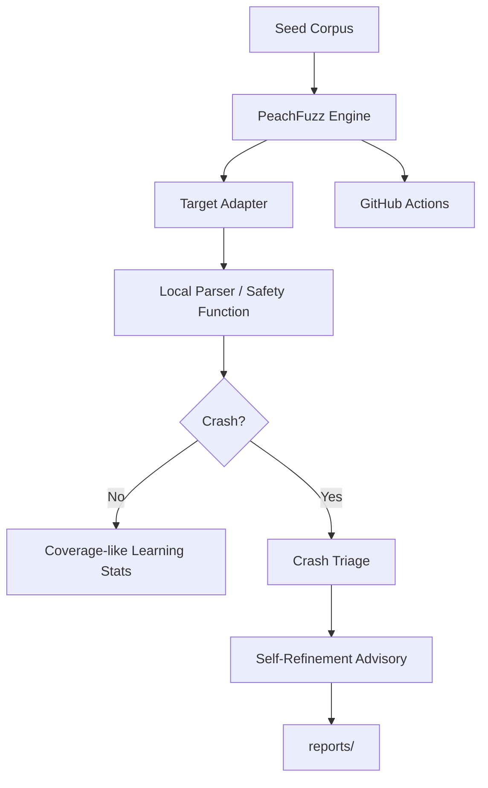

# 🍑 PeachFuzz AI

PeachFuzz AI is a defensive, agentic fuzzing harness for parser, API, and LLM-agent safety testing.

It is designed as a standalone companion project for Hancock by CyberViser / 0AI:

- coverage-guided fuzzing when `atheris` is installed
- deterministic fallback fuzzing when `atheris` is unavailable
- crash triage and self-refinement advisories
- LangGraph-inspired state tracking without requiring LangGraph at runtime
- CI-safe GitHub Actions fuzz smoke tests
- no offensive network activity and no exploit execution

## Safety model

PeachFuzz AI only fuzzes local parser functions and local harness targets. It does not scan networks, exploit targets, run shell payloads, or contact third-party systems.

## Quick start

```bash
python -m venv .venv
source .venv/bin/activate
python -m pip install -e ".[dev,fuzz]"

pytest -q
python -m peachfuzz_ai.cli run --target json --runs 250
python -m peachfuzz_ai.cli run --target findings --runs 250
```

## Atheris mode

```bash
python -m pip install -e ".[fuzz]"
python -m peachfuzz_ai.cli atheris --target json corpus/json_api
```

If `atheris` is not available, use deterministic mode:

```bash
python -m peachfuzz_ai.cli run --target json --runs 1000
```

## GitHub deployment

```bash
gh repo create 0ai-Cyberviser/peachfuzz --public --source=. --remote=origin --push
```

Or with raw git after creating the empty repo:

```bash
git init
git add .
git commit -m "feat: initial PeachFuzz AI harness"
git branch -M main
git remote add origin git@github.com:0ai-Cyberviser/peachfuzz.git
git push -u origin main
```

## Architecture



## Project status

Initial release: `v0.1.0`


## Mythos Glasswing self-refinement

PeachFuzz v0.2.0 adds **Mythos Glasswing**, a polished self-refinement profile that analyzes fuzz reports and writes human-reviewable update proposals.

```bash
python -m peachfuzz_ai.cli run --target json --runs 500 corpus/json_api
python -m peachfuzz_ai.cli refine --report-dir reports --output MYTHOS_GLASSWING_PLAN.md
```

This mode is proposal-only: it does not auto-merge, push, scan networks, exploit targets, or bypass review.


## peachfuzz-cactusfuzz split

This project now has two editions:

- **PeachFuzz**: defensive blue-team fuzzing only.
- **CactusFuzz**: authorized red-team/adversarial fuzzing for owned/lab systems and AI-agent safety testing.

```bash
peachfuzz editions
peachfuzz run --target json --runs 250 corpus/json_api
cactusfuzz --target local-lab --scope local-lab
```

CactusFuzz is scope-gated and simulation-first. It does not enable unauthorized scanning, exploit delivery, shell payloads, credential theft, persistence, or third-party contact by default.


## Competitive radar and number-one roadmap

PeachFuzz/CactusFuzz v0.4.0 adds an offline competitive radar derived from public GitHub discovery.

```bash
peachfuzz radar
peachfuzz radar --format json
peachfuzz roadmap
peachfuzz roadmap --format json
```

Use this to guide feature priority without adding unsafe scraping behavior to CI.


## Backend adapters

PeachFuzz/CactusFuzz v0.4.1 adds a fuzz backend adapter layer.

```bash
peachfuzz backends
peachfuzz backends --include-unsafe
peachfuzz run --target json --backend deterministic --runs 250 corpus/json_api
```

The default `deterministic` backend remains local-only and CI-safe. `atheris` is optional for Python coverage-guided sessions. `external-sandbox` is a disabled placeholder for future AFL++/LibAFL/native integrations and cannot run until sandbox, authorization, and audit controls exist.


## Agent guardrail fuzzing pack

CactusFuzz v0.4.2 adds a simulation-only AI-agent guardrail pack.

```bash
cactusfuzz --target local-lab --scope local-lab --pack agent-guardrails
cactusfuzz --target local-lab --scope local-lab --pack agent-guardrails --format markdown
```

The pack checks prompt-injection, unsafe tool routing, approval bypass, exfiltration, persistence, and benign local schema-fuzz controls without executing tools or contacting networks.


## Schema-aware mutators

PeachFuzz v0.4.3 adds local-only schema-aware corpus generation and parser targets.

```bash
peachfuzz schemas --kind all --count 4 --output corpus/generated/schema
peachfuzz run --target openapi --backend deterministic --runs 250 corpus/generated/schema/openapi
peachfuzz run --target graphql --backend deterministic --runs 250 corpus/generated/schema/graphql
peachfuzz run --target webhook --backend deterministic --runs 250 corpus/generated/schema/webhook
```

These mutators generate structured local corpus files for JSON API envelopes, OpenAPI JSON, GraphQL documents, and webhook envelopes. They do not execute queries, contact networks, or deliver payloads.


## PeachTrace dependency-free trace-guided fuzzing

PeachFuzz v0.4.4 adds **PeachTrace**, a pure-Python Atheris-inspired backend with no native fuzzing dependency.

```bash
peachfuzz run --target json --backend peachtrace --runs 500 corpus/json_api
peachfuzz peachtrace --target openapi --runs 500 corpus/openapi
peachfuzz backends --include-unsafe
```

Atheris is now legacy-optional. The built-in recommended coverage-style backend is `peachtrace`.

## Crash minimization and pytest reproducers

PeachFuzz v0.4.5 adds local-only crash minimization and pytest reproducer generation.

```bash
peachfuzz minimize --target graphql reports/crashes/graphql-example.bin
peachfuzz reproduce --target graphql reports/minimized/graphql-example.bin --output tests/regression
peachfuzz minimize-reports --report-dir reports --generate-reproducers
```

The generated reproducer tests embed payloads safely with base64 and call only registered local PeachFuzz targets.
